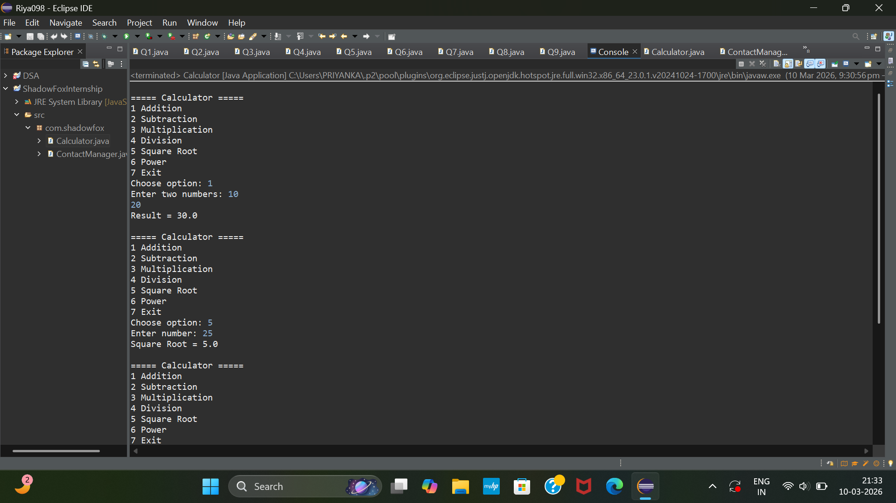
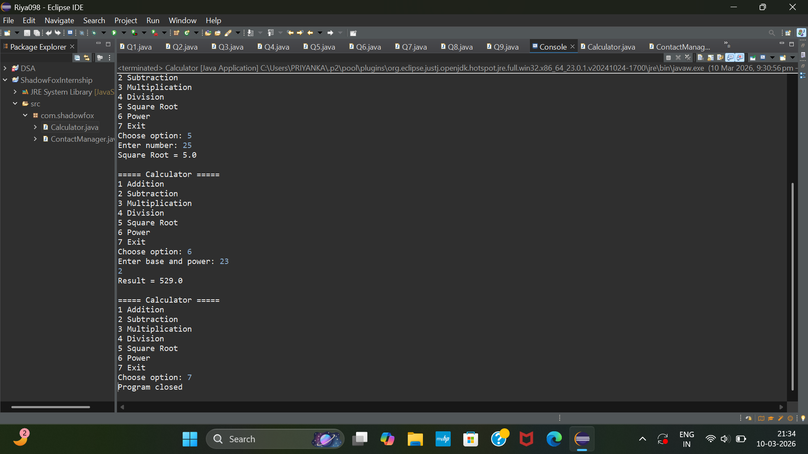

# ShadowFox Java Internship

This repository contains my tasks for the ShadowFox Java Internship.

## Task 1: Calculator Program
A simple Java console calculator that performs basic arithmetic operations.

### Code
Calculator.java

### Output

---

## Task 2: Contact Management System
A Java program that allows users to add, view, and manage contacts using the console.

### Code
ContactManager.java

### Output

---

## Technologies Used
- Java
- OOP Concepts
- Console-based Application